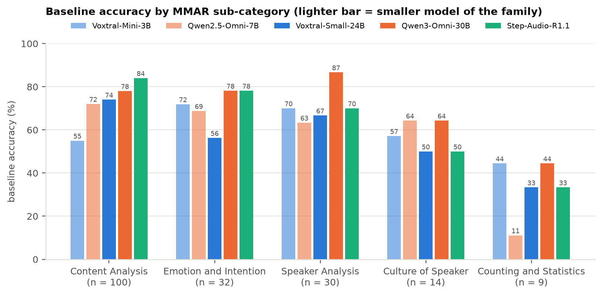
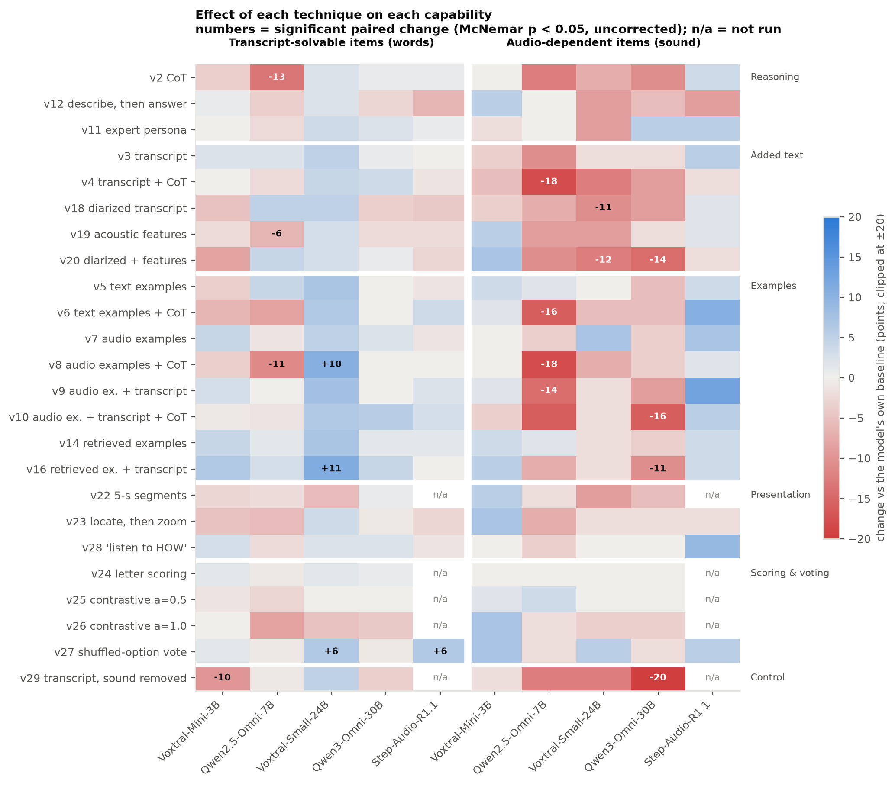
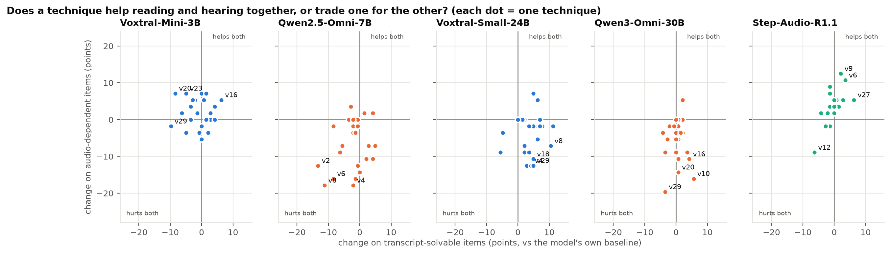

# 2. Model profiles

How each model performs on the three capabilities defined in `01_METHODOLOGY.md` §1.2, and how each
technique moves them:

- **Reading the words:** accuracy on the 143 transcript-solvable (TS) items.
- **Hearing the sound:** accuracy on the 56 audio-dependent (AD) items, and on ICBHI for the two models
  that ran it.
- **Combining both:** overall accuracy, and whether a technique moves TS and AD together.

Every number here comes from `data/mmar_summary.csv`, `data/mmar_items.csv`, `data/icbhi_summary.csv` and
`data/icbhi_answers.csv`, built by `scripts/build_report_data.py`. The figures are drawn from the same
tables by `scripts/build_report_figures.py`.

**Reading the statistics** (full definitions in `01_METHODOLOGY.md` §1.5):
- **Won / lost and the McNemar test.** Two conditions (a technique and the baseline, or two models) answer
  the same questions. *Won* = questions the technique gets right that the baseline got wrong; *lost* = the
  reverse. Questions both get right, or both get wrong, say nothing about the difference. The McNemar test
  asks one question: if the technique had no real effect, how likely is a won / lost split at least this
  uneven? That likelihood is the p-value. For example, 16 won and 4 lost: if the technique did nothing,
  each of the 20 flipped questions would be a fair coin toss, and 20 fair tosses split 16 / 4 or more
  unevenly (in either direction) with probability 2 × 6,196 / 2²⁰ = 0.012, about 1 in 85.
- **Holm correction.** We test ~24 techniques per model. At p < 0.05, about one in twenty useless techniques
  would look "significant" by luck, so with 24 we expect one false hit per model. Holm correction raises
  each p-value to account for the number of tests: the smallest p-value is multiplied by 24, the next by
  23, and so on. A change is called **significant** only if its corrected p-value is still below 0.05.
- **Uncorrected p < 0.05** is reported as **a signal worth noting**, not a finding.
- **Small subset:** on the 56 AD items, only differences of about 18 points or more can reach significance
  (§1.2).

---

## 2.1 The five models side by side

| Model | Overall | Reading the words (TS) | Hearing the sound (AD) | AD above chance? | Unparsed | Top answer |
|---|---|---|---|---|---|---|
| Voxtral-Mini-3B | 59.3 | 73.4 | **23.2** | no (below chance, p = 0.97) | 0.0% | 6.7% |
| Qwen2.5-Omni-7B | 65.8 | 73.4 | 46.4 | yes (p = 0.02) | 0.0% | 9.5% |
| Voxtral-Small-24B | 65.8 | 75.5 | 41.1 | no (p = 0.13) | 0.5% | 7.5% |
| Qwen3-Omni-30B-A3B | **76.9** | 87.4 | **50.0** | yes (p = 0.006) | 0.0% | 7.0% |
| Step-Audio-R1.1 | 73.9 | **88.1** | 37.5 | no (p = 0.29) | 3.2% | 8.2% |
| *Text-only control (Gemma-4-26B-A4B, transcript only)* | *71.9* | *100 by definition* | *0 by definition* | | | |

Baseline prompt, majority vote of 3 runs. Chance: 32.0% overall, 31.5% TS, 33.2% AD.

- **"AD above chance?"** asks whether the model's hearing score could come from guessing. We simulate a
  guesser that picks a random option for each of the 56 AD questions (1 in 2 for two-option questions, 1 in
  4 for four-option ones), many thousands of times, and count how often it does at least as well as the
  model. That share is the p-value: Qwen3-Omni's 50.0% is reached by the guesser 0.6% of the time
  (p = 0.006), so it really hears; Step-Audio's 37.5% is reached 29% of the time (p = 0.29), so its score
  could be luck.
- **"Top answer"** is the share of all answers that are the single most common answer. Near 100% would
  mean the model gives the same answer to everything; none of the models does on MMAR.

*Each dot is a model's baseline accuracy on the two subsets: reading the words (x) and hearing the sound
(y). Dashed lines mark chance.*

**What the figure shows:**
- **Reading the words separates the models into two groups.** Three models read at about 73–76% (Voxtral-Mini,
  Qwen2.5, Voxtral-Small) and two at about 88% (Qwen3-Omni, Step-Audio).
- **Hearing does not follow reading.** The two best readers are the best and the fourth-best listeners.
  Step-Audio reads as well as Qwen3-Omni but hears 12.5 points worse.
- **Only two models are clearly above chance on hearing:** Qwen3-Omni and Qwen2.5-Omni, the two models whose
  encoders were trained further on broad audio (§1.1). Voxtral-Mini is below chance: when the words do not
  contain the answer, it picks the option that matches the words.

### By MMAR sub-category

- **Content Analysis** (what is said, n = 100) tracks reading the words: Step-Audio leads (84%).
- **Speaker Analysis** (n = 30) is where Qwen3-Omni stands out (87% against 63–70% for the others).
- **Emotion and Intention** (n = 32) does not grow with size: Voxtral-Mini (72%) beats Voxtral-Small (56%).
- **Counting and Statistics** (n = 9) is at or near chance for every model.

Categories with fewer than 14 items are left out of the figure; read the small categories as direction only.

---

## 2.2 How each technique affects each capability

*Change against each model's own baseline, split by subset. Blue = better, red = worse. A number marks a
paired change with p < 0.05 before correction. "n/a" = not run (Step-Audio has no letter probabilities,
v22 crashed its server, v29 was not run on it). The v29 row is v29 against the **baseline** (transcript only
vs audio only); v29 against v3 is analysed in §2.3.*

**On MMAR, only two changes survive Holm correction, and both are losses:** Qwen2.5-Omni with chain-of-thought (v2,
−13.1, Holm p = 0.002) and with audio examples + chain-of-thought (v8, −13.1, Holm p = 0.002). No
technique produces a significant gain on MMAR for any model.

**Patterns that repeat across models** (directions, uncorrected):

| Pattern | Evidence |
|---|---|
| **Added text pulls answers away from the sound** | Diarized transcripts and acoustic features (v18–v20) lower AD for Voxtral-Small (−11, −12) and Qwen3-Omni (−14), while TS barely moves |
| **Chain-of-thought hurts the small Qwen, and nowhere helps hearing** | Qwen2.5: −13 TS, −13 AD. Every CoT variant on Qwen2.5 loses 12–18 points on AD |
| **Examples and voting help reading, mainly for Voxtral-Small** | v16 retrieved examples + transcript +11 TS, v8 +10 TS, v27 voting +6 TS |
| **Nothing reliably improves hearing** | No positive AD change reaches p < 0.05 for any model |
| **Scoring tricks do nothing** | Letter scoring and contrastive scoring (v24–v26) stay within ±5 for every model |

### Do techniques help both capabilities, or trade one for the other?

*Each dot is one technique for one model, placed by its change on TS (x) and AD (y). The four most extreme
techniques per model are labelled.*

- **Voxtral-Mini:** techniques scatter around zero; gains on one subset are small and do not come at the
  other's expense.
- **Qwen2.5-Omni:** most dots sit in the lower half; many techniques **hurt hearing** (down to −18), and the
  reasoning ones (v2, v4, v6, v8) hurt both.
- **Voxtral-Small:** a clear **trade-off**: most dots sit right and below, i.e. techniques add words
  (+3 to +11 TS) while taking away hearing (−2 to −13 AD).
- **Qwen3-Omni:** the same trade-off, mostly on AD: added text costs it up to 16 AD points for small TS gains.
- **Step-Audio-R1.1:** the only model whose dots sit mostly **above** zero; examples and voting help both
  (v9 +12.5 AD, v6 +10.7 AD, not significant), and only multi-turn decomposition (v12) hurts both.

So for the two models that hear best on the baseline, the same techniques that add reading cost hearing.
Only the reasoning model takes added text or examples without losing hearing.

---

## 2.3 Does hearing the audio help or hurt reading the transcript? (v3 vs v29)

v3 gives the model the audio and a Whisper transcript; v29 gives the same prompt and transcript with the
recording replaced by silence (§1.4). Same model, same text, only the sound removed.

| Model | v3 audio + transcript (all / TS / AD) | v29 silence + transcript (all / TS / AD) | Removing the audio: TS | Removing the audio: AD |
|---|---|---|---|---|
| Voxtral-Mini-3B | 59.8 / 75.5 / 19.6 | 51.8 / 63.6 / 21.4 | **−11.9** (4 won, 21 lost, p = 0.001) | +1.8 |
| Qwen2.5-Omni-7B | 64.3 / 75.5 / 35.7 | 61.8 / 72.7 / 33.9 | −2.8 (n.s.) | −1.8 (n.s.) |
| Voxtral-Small-24B | 68.8 / 80.4 / 39.3 | 65.8 / 80.4 / 28.6 | **0.0** (9 won, 9 lost) | −10.7 (p = 0.11) |
| Qwen3-Omni-30B-A3B | 76.9 / 88.1 / 48.2 | 68.8 / 83.9 / 30.4 | −4.2 (n.s.) | **−17.8** (3 won, 13 lost, p = 0.02) |

- **The audio does not interfere with reading.** No model reads the transcript better without the sound.
  Voxtral-Small reads exactly as well with or without it.
- **For the smallest model the audio helps it read** (−12 TS without it).
- **For the best listeners, removing the sound removes their hearing:** Qwen3-Omni drops to chance on AD,
  Voxtral-Small about 11 points, while their TS scores stay put.
- **The gap to the text-only model is a language-model gap.** With the transcript and no sound, every audio
  model is still below Gemma-4-26B-A4B reading the same transcript (51.8–68.8 vs 71.9).

*Caveat:* silence is not "no audio"; the model still receives silent audio tokens (§1.4).

---

## 2.4 Per-model profiles

### Voxtral-Mini-3B: reads like its big sibling, cannot hear beyond the words

- **Capabilities:** reading 73.4% (on par with Qwen2.5 and Voxtral-Small); hearing 23.2%, **below chance**.
  On AD items it is drawn to the option that matches the words.
- **What helps (none significant):** retrieved examples + transcript (v16) +6.0 overall; retrieved
  examples (v14) +4.0; audio examples (v7) and voting (v27) +3.0.
- **What hurts:** removing the audio (v29) −7.5 overall, −9.8 TS against baseline (p = 0.02 uncorrected);
  diarized transcript (v18) −4.5.
- **Technique map:** small effects around zero; no technique trades one capability for the other.
- **Notable:** the only model where external acoustic text helps hearing at all (v19 acoustic features
  +5.4 AD, v20 +7.1 AD, n.s.): a weak ear can use written measurements, a stronger one is distracted by
  them.
- **Output health:** no unparsed answers, no collapse.

### Qwen2.5-Omni-7B: a small model that hears, and is easily derailed

- **Capabilities:** reading 73.4%; hearing 46.4%, **above chance** (p = 0.02), better than the 24B
  Voxtral-Small with about a third of the parameters.
- **What helps:** nothing reliably. Text examples (v5) +3.5, retrieved examples (v14) +1.5.
- **What hurts:** reasoning. Chain-of-thought (v2) **−13.1** and audio examples + CoT (v8) **−13.1**
  (both Holm p = 0.002, the only Holm-significant effects in the study); text examples + CoT (v6) −10.6;
  acoustic features (v19) −7.0.
  The losses are not formatting failures: only 1.3% of CoT answers are unparsed.
- **Technique map:** most techniques lower hearing; every reasoning variant lowers both capabilities.
- **Categories:** weakest on Counting (11%, n = 9) and on the Perception layer (29.4%, n = 17).
- **Output health:** no unparsed answers, no collapse, no switch to Chinese.

### Voxtral-Small-24B: better words through examples, at the cost of hearing

- **Capabilities:** reading 75.5%; hearing 41.1% (not significantly above chance, p = 0.13).
- **What helps (none survives Holm):** retrieved examples + transcript (v16) **+7.5** (p = 0.017,
  Holm 0.38); shuffled-option voting (v27) **+6.0** (p = 0.012, Holm 0.28); audio examples (v7) +5.5.
  Almost all of it is on reading: v16 +11.2 TS, v8 +10.5 TS.
- **What hurts:** 5-second segments (v22) −6.5, partly because 8.5% of its answers become unparsed;
  contrastive scoring α = 1 (v26) −4.5.
- **Technique map:** the clearest **trade-off** of all models: techniques that add words take away
  hearing. Diarized transcripts (v18) and diarized + features (v20) cost −10.7 and −12.5 on AD.
- **Categories:** Emotion and Intention 56% (below its 3B sibling's 72%).
- **Out-of-Knowledge (ICBHI):** see §2.5.

### Qwen3-Omni-30B-A3B: the best listener, and the most robust to prompting

- **Capabilities:** reading 87.4% and hearing 50.0% (**above chance**, p = 0.006): best overall (76.9%).
  Removing the sound (v29) takes hearing to chance (30.4%), which confirms that the 50% comes from
  listening (§1.2).
- **What helps:** almost nothing moves it upward. Expert persona (v11) +3.0, "listen to HOW" (v28) +1.5.
- **What hurts:** removing the audio (v29) −8.0 overall (p = 0.007, Holm 0.17); diarized transcript (v18)
  −5.0 (p = 0.04); added text in general costs hearing: v20 −14.3 AD, v10 −16.1 AD, v16 −10.7 AD.
- **Technique map:** its baseline is close to its ceiling; prompting can only move answers away from what
  it hears.
- **Categories:** best on Speaker Analysis (87%) and on the Perception layer (64.7% vs 29.4% for Qwen2.5).
- **Out-of-Knowledge (ICBHI):** see §2.5.

### Step-Audio-R1.1: the best reader, a frozen ear

- **Capabilities:** reading 88.1% (best); hearing 37.5% (not significantly above chance, p = 0.29).
  Every significant difference to the smaller models is on the TS items (`CROSS_MODEL_ANALYSIS.md`).
  Its encoder was frozen during training (§1.1).
- **What helps (none survives Holm):** shuffled-option voting (v27) **+6.0** (16 won, 4 lost, p = 0.012,
  Holm 0.23); text examples + CoT (v6) +5.5; audio examples + transcript (v9) +5.0 (+12.5 AD, n.s.).
  Voting asks each question five times, so it also works as five samples of its reasoning.
- **What hurts:** multi-turn decomposition (v12) −7.0 (p = 0.04, Holm 0.69).
- **Technique map:** the only model whose techniques mostly sit in the "helps both" quadrant. As a
  reasoning model, chain-of-thought does not hurt it (+1.5), and added text does not cost it hearing
  (v18 +1.8 AD, v19 +1.8 AD).
- **Output health:** it reasons before every answer (~3,200 characters in the baseline); 1.5–5.4% of
  answers per arm run out of tokens while thinking and count as wrong, so its scores may be up to ~3
  points low.

---

## 2.5 Out-of-Knowledge lane: lung sounds (ICBHI)

Only Voxtral-Small and Qwen3-Omni ran ICBHI. Any strategy that ignores the recording scores 16.7% balanced
accuracy (BA); a one-line rule on the recording device scores 33.3% (§1.2).

*Share of each diagnosis among all answers (3 runs), against the true label distribution. No technique is
applied here: "audio" is the plain baseline prompt with the recording (r0), "silence" is the **same prompt**
with the recording replaced by silence of the same length (c1). The only difference between the two bars
of a model is the sound.*

| | Voxtral-Small-24B | Qwen3-Omni-30B-A3B |
|---|---|---|
| Baseline BA (accuracy) | 7.5 (10.1) | 16.7 (20.2) |
| Answers with the recording | LRTI 46%, COPD 34%, Pneumonia 21% | "healthy" 100% |
| Answers with silence | LRTI 74%, Pneumonia 26% | "healthy" 100% |
| Does the audio change the answers? | yes (BA 7.5 vs 0.7, p = 0.001) | no: identical answers |
| Best arm | retrieved neighbours' diagnoses as text (a6a): **23.7**, Holm p = 0.003 | the same arm: 23.2 (n.s.) |
| Worst arms | features, cycles, dictionary + CoT: 0.0 BA, "Asthma" 90–99% | features + band-pass: 5.6 BA |

- **Neither model can diagnose from the sound.**
  - *Voxtral-Small* hears that recordings differ (its answers change with silence), but maps the
    difference to the wrong labels. Its only real signal comes from being told the diagnoses of similar
    recordings (a6a), which is no longer zero-shot.
  - *Qwen3-Omni* answers "healthy" to every recording, with sound and with silence, so its BA of 16.7 is
    exactly the score of a constant answer. The sound does reach the model, it just never changes the
    decision: with a features-and-dictionary prompt, swapping the recording for silence changes 33% of its
    answers, and scoring the letters against silence reorders its answer probabilities. Its default
    "healthy" is simply stronger than anything it hears in a lung recording. On MMAR the same model clearly
    hears (§2.3), so this is the domain, not a broken audio input.
- **Text cues dominate.** For Voxtral-Small, adding measured features or a written dictionary makes it
  answer "Asthma", a class with one recording, for 90–99% of recordings.
- **Prompting does not open this lane** for either model; full arm-by-arm tables are in
  `ICBHI_V4_ANALYSIS.md`.

---

## 2.6 Summary per model

| Model | Reads the words | Hears the sound | Best technique (uncorrected) | Worst technique | Main lesson |
|---|---|---|---|---|---|
| Voxtral-Mini-3B | average | **no** (below chance) | v16 +6.0 | v29 −7.5 | a small Whisper-based model gets the words, not the sound |
| Qwen2.5-Omni-7B | average | yes | v5 +3.5 | v2 / v8 **−13.1** (Holm-significant) | do not ask a small model to reason out loud |
| Voxtral-Small-24B | average | weak | v16 +7.5 | v22 −6.5 | examples buy words and cost hearing |
| Qwen3-Omni-30B-A3B | strong | **best** | v11 +3.0 | v29 −8.0 | near its ceiling; extra text only distracts it |
| Step-Audio-R1.1 | **best** | weak | v27 +6.0 | v12 −7.0 | a strong reasoner on a frozen ear |
