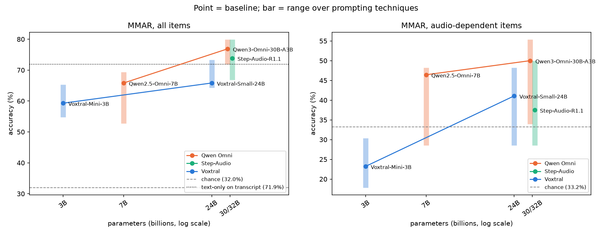
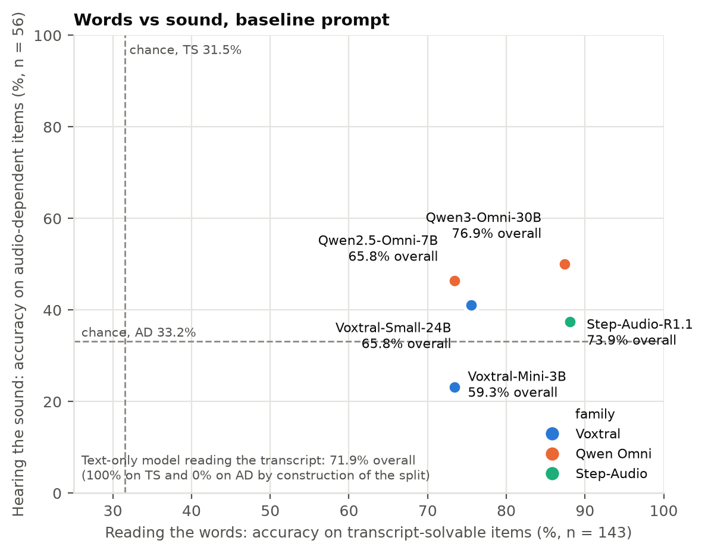
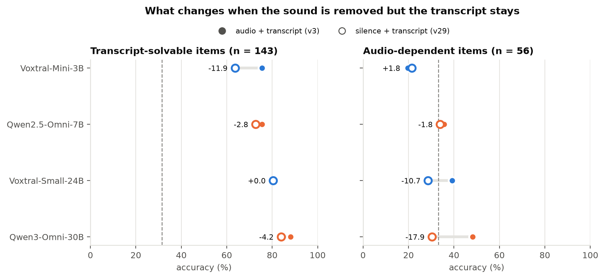
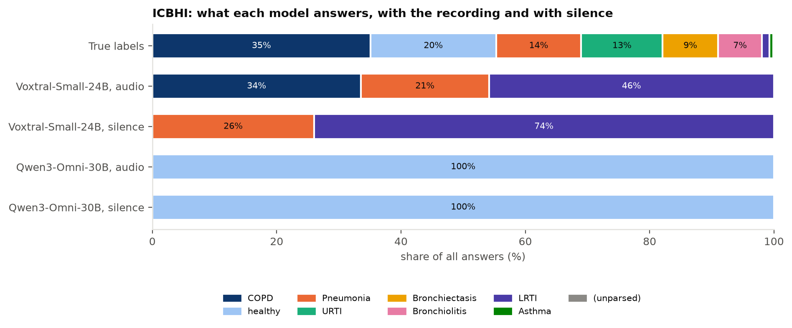

# 3. Conclusions

What the study shows, what it does not, and what to try next. Methods are in `01_METHODOLOGY.md`, the
per-model evidence in `02_MODEL_PROFILES.md`. Every number here comes from the same tables
(`data/*.csv`).

**The study in one paragraph.** Five open audio-language models (3B to 32B) answered 199 English-speech
questions from MMAR with ~24 prompting techniques each, and two of them also tried to diagnose 168
lung-sound recordings (ICBHI). Splitting MMAR into questions the transcript can answer and questions that
need the sound lets us measure **reading the words** and **hearing the sound** separately. The models read
the words well and hear the sound poorly; choosing a better model changes this far more than any prompt.
On audio they were never trained on, every model and every technique fails.

---

## 3.1 Main findings

### Finding 1: Model choice matters more than prompting

*Point = baseline accuracy; bar = range over the 19 techniques every model ran; lines join models of one
family. Right panel: the 56 audio-dependent items.*

- **The spread between models is larger than any prompting effect.** Baselines range from 59.3%
  (Voxtral-Mini) to 76.9% (Qwen3-Omni), 17.6 points apart. The best technique for any model adds at most
  +7.5 points (Voxtral-Small with retrieved examples), and the typical best is +3 to +6.
- **No prompting gain survives correction.** Across 115 model × technique comparisons on MMAR, 3 gains
  reach p < 0.05 before correction and none after Holm correction. The only Holm-significant effects are
  two losses (chain-of-thought on Qwen2.5-Omni, −13.1).
- **Prompting can hurt more than it helps.** The worst technique per model costs 6.5 to 13.1 points; the
  best adds 3.0 to 7.5.

### Finding 2: Bigger is better within a family, not across families

| Comparison | Change | Paired test |
|---|---|---|
| Voxtral 3B → 24B (same family) | +6.5 | p = 0.09 |
| Qwen Omni 7B → 30B-A3B (same family, newer generation) | +11.1 | p = 0.002 |
| Qwen2.5-Omni-7B vs Voxtral-Small-24B | 0.0 (65.8 each) | a third of the size, same score |
| Step-Audio-R1.1 (32B dense) vs Qwen3-Omni (30B, ~3B active) | −3.0 | 20 won, 26 lost, p = 0.46 |

Within a family, the larger model is better. Across families, size does not predict accuracy: a 7B model
ties a 24B one, and the largest model does not beat a mixture-of-experts model that uses ~3B parameters
per token. Family and training matter as much as size.

### Finding 3: Size buys reading the words, not hearing the sound

- **Step-Audio-R1.1, the largest model, reads best (88.1% on transcript-solvable items) and hears at
  chance level (37.5% on audio-dependent items, p = 0.29 against guessing).**
- Against the smaller models, all of its significant gains are on reading: +12.6 over Voxtral-Small
  (p = 0.003) and +14.7 over Qwen2.5-Omni (p < 0.001) on transcript-solvable items; on audio-dependent items
  it is 3.6 and 8.9 points *behind* them (not significant).
- Its audio encoder was **frozen** during training: all its 8M hours of audio training went into the
  adapter and the language model. The result fits: the language model got stronger, the ear did not.

### Finding 4: Hearing follows how the ear was trained, not model size

- All five models have an audio encoder of the same size (~0.6B, Whisper-large-v3 shape). What differs is
  how it was trained (§1.1).
- **The two models clearly above chance on hearing are the two Qwen models**, whose encoders were trained
  further on broad audio: Qwen3-Omni (new encoder, 20M hours) 50.0% (p = 0.006) and Qwen2.5-Omni 46.4%
  (p = 0.02).
- **Qwen3-Omni really does hear:** with the sound replaced by silence, its audio-dependent score drops from
  48.2% to 30.4%, i.e. to chance (p = 0.02), while its transcript-solvable score barely moves.
- **Category view:** Qwen3-Omni leads Speaker Analysis (87% vs 63–70%) and the Perception layer (65% vs
  29% for Qwen2.5). Counting is at or near chance for every model.

*Caveat:* hearing is measured on 56 questions, so only differences of ~18 points or more can be shown
(§1.2). Findings 3 and 4 rest on consistent directions across models plus the few differences that pass
the paired test.

### Finding 5: The audio does not get in the way of the words; written text gets in the way of the sound

- **Same model, same transcript, sound removed (v3 → v29):** no model reads the transcript better without
  the sound. Voxtral-Small reads exactly as well (80.4% both times); the smallest model reads worse
  without it (−11.9, p = 0.001).
- **The gap to a text-only model is a language-model gap:** with the transcript and no sound, every audio
  model still scores below Gemma-4-26B-A4B reading the same transcript (51.8–68.8% vs 71.9%).
- **The reverse interference is real:** for the models that hear best, adding written evidence pulls them
  away from the sound. Diarized transcripts and acoustic measurements cost Voxtral-Small up to 12.5 and
  Qwen3-Omni up to 14.3 points on audio-dependent items, while reading barely changes
  (`fig_technique_heatmap.png`).

### Finding 6: On audio they were never trained on, every model fails

- **No model can diagnose lung disease from the recording.** Qwen3-Omni answers "healthy" to every
  recording, identically with sound and with silence (16.7% balanced accuracy = a constant answer).
  Voxtral-Small hears that recordings differ but maps the difference to wrong diagnoses (7.5%).
- **No technique opens this lane:** role prompts, reasoning, written disease descriptions, measured
  features, audio filtering and calibrated scoring all stay at or below the level of a recording-blind
  strategy.
- **The only real signal is borrowed:** telling Voxtral-Small the diagnoses of the most similar labelled
  recordings reaches 23.7% (Holm p = 0.003), which is retrieval of labels, not zero-shot hearing. A
  one-line rule on the recording device would still do better (33.3%).

### Finding 7: Prompting gains do not transfer between models

What helps one model does nothing or harm for another:

| Technique | Helps | Does nothing or hurts |
|---|---|---|
| Retrieved examples + transcript (v16) | Voxtral-Small +7.5, Voxtral-Mini +6.0 | Qwen2.5 0.0, Qwen3 0.0 |
| Shuffled-option voting (v27) | Voxtral-Small +6.0, Step-Audio +6.0 | Qwen2.5 −1.0, Qwen3 −1.0 |
| Chain-of-thought (v2) | Step-Audio +1.5 | Qwen2.5 −13.1 |

A technique has to be validated per model; a recipe tuned on one model is not evidence for another.

---

## 3.2 What not to do

Lessons from the techniques that hurt. Each is backed by a measured loss.

| Don't | Because | Evidence |
|---|---|---|
| **Ask a small non-reasoning model to reason out loud** | It talks itself out of right answers | Qwen2.5-Omni with chain-of-thought −13.1 (Holm p = 0.002); with examples + CoT −13.1 (Holm p = 0.002) |
| **Feed written acoustic evidence to a model that already hears** | Text replaces listening | v20 diarized + features: Voxtral-Small −12.5, Qwen3-Omni −14.3 on audio-dependent items |
| **Replace the audio with a transcript** | It removes hearing and does not improve reading | v29: Qwen3-Omni −17.8 on audio-dependent items; Voxtral-Mini −11.9 on transcript-solvable items |
| **Give a model written disease descriptions or measurements on unfamiliar audio** | It latches onto a word in the text | ICBHI: Voxtral-Small answers "Asthma" (1 recording out of 168) for 90–99% of recordings |
| **Break the audio into pieces or the task into turns without testing it** | Extra turns and segments add failure modes | Voxtral-Small 5-s segments −6.5 (8.5% unparsed); Step-Audio describe-then-answer −7.0 |
| **Judge hearing by overall accuracy** | Reading the words can hide a weak ear | Step-Audio 73.9% overall, yet at chance on audio-dependent items |
| **Report a score without the answer distribution** | A constant answer can look like progress | ICBHI: Voxtral-Small chain-of-thought "+9.2" is answering "healthy" to everything; Qwen3-Omni's 16.7 is one answer for all |
| **Expect scoring tricks to reveal hidden hearing** | They do not | Letter and contrastive scoring (v24–v26) stay within ±5 on MMAR for every model |
| **Carry a prompt recipe from one model to another** | Gains are model-specific | Finding 7 |

---

## 3.3 Limitations

- **Small hearing test.** Hearing is measured on 56 MMAR questions, of which only ~20 ask directly about
  the voice or sound; differences under ~18 points cannot be shown. The MMAR subset is 81% Semantic
  (about what is said).
- **The split is defined by one text model.** "Audio-dependent" means Gemma-4-26B-A4B failed from the
  transcript; some of these items are hard rather than acoustic. The v29 result on Qwen3-Omni supports the
  split, but does not make it exact.
- **Silence is not "no audio".** v29 sends silent audio tokens, an unusual input that may itself disturb a
  model.
- **Model size is capped by the hardware.** One 96 GB GPU fits about 32B parameters in BF16; we could not
  test larger open models or closed ones.
- **Step-Audio-R1.1 is not fully comparable.** It ran on its vendor's server: no letter-probability arms
  (v24–v26), chunked audio (v22) crashed the server, v29 was not run, and 1.5–5.4% of its answers per arm
  ran out of tokens while reasoning (scored as wrong).
- **ICBHI packaging.** No patient identities (a reference recording may share a patient with a test one),
  the recording device is confounded with the diagnosis, and only two models ran it.
- **One wording per technique.** Each technique was tested with one prompt; a different wording may
  behave differently.
- **Hallucination was not measured directly.** ICBHI here has no per-cycle crackle / wheeze labels to check
  the models' descriptions against.

---

## 3.4 Future work

1. **Larger and closed models.** Repeat the core arms (baseline, v3, v29, chain-of-thought, examples,
   silence controls) with larger open models on multi-GPU or FP8 setups, and with closed models that take
   audio directly (e.g. Gemini).
2. **Late fusion of a listener and a reader.** The audio model and the text-only model fail on different
   questions. An arbiter that always picked the right one of the two answers would reach **83.4%**
   (Voxtral-Small + Gemma) and **85.9%** (Qwen3-Omni + Gemma), against 76.9% for the best single model. A
   pilot: a large text model (70B+ or closed) sees the question, the transcript and both answers with their
   reasoning, and picks one. Only the arbiter needs to run; both models' answers already exist.
3. **A larger hearing test.** MMAR's ~700 items beyond pure speech (music, sounds, mixtures), or a dataset built on
   paralinguistic labels (emotion, speaker traits), to measure hearing on hundreds of items rather than 56.
4. **Measure hallucination directly.** Ask for chain-of-thought descriptions on silence and count invented
   findings; on the original ICBHI 2017 database (per-cycle crackle / wheeze labels), score the models'
   acoustic descriptions against ground truth.
5. **Teach the out-of-knowledge domain.** Since zero-shot fails completely on lung sounds, test light
   fine-tuning (adapter-only) or retrieval from a larger labelled pool (the original 920-recording ICBHI
   database).
